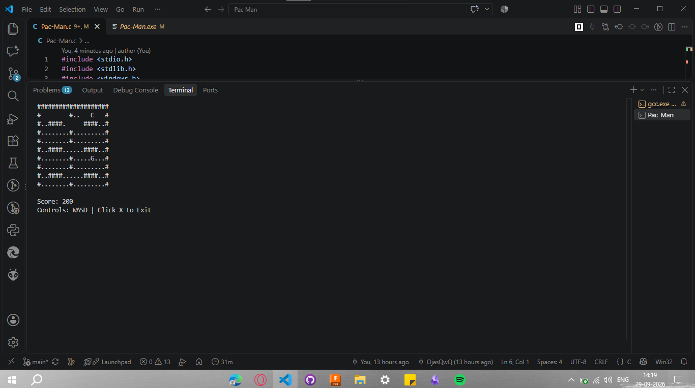

# Pac-Man Game

A terminal-based Pac-Man game built in C using the Windows console API. Play as "C", collect dots, and outsmart the ghost "G" in this classic maze game.



## Features

- **Player Control**: Navigate the maze as "C" using WASD keys
- **Ghost AI**: The ghost "G" actively pursues the player
- **Scoring System**: Collect dots (.) to earn points
- **Collision Detection**: Game ends when the ghost catches you
- **Maze Layout**: 10x20 grid with walls and pathways

## Controls

- **W** - Move up
- **A** - Move left
- **S** - Move down
- **D** - Move right
- **X** - Exit game

## How to Run

### Prerequisites
- Windows OS
- GCC compiler (MinGW)

### Compilation
```bash
gcc Pac-Man.c -o Pac-Man
```

### Execution
```bash
.\Pac-Man.exe
```

## Gameplay

1. Start the game and navigate "C" through the maze
2. Collect all the dots (.) to increase your score (+10 per dot)
3. Avoid the ghost "G" - if it catches you, the game is over
4. Try to get the highest score!

## Code Overview

- **setup()** - Initializes game state and positions
- **draw()** - Renders the maze, player, and ghost to the console
- **input()** - Handles keyboard input for player movement
- **logic()** - Updates ghost AI and checks for collisions
- **clearScreen()** - Clears the Windows console

## Built With

- C language
- Windows Console API (`windows.h`)